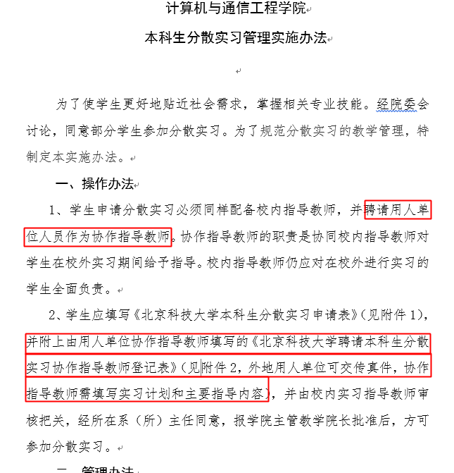

协作指导教师：是要找到企业的一个tutor写他的信息 会有一个带你的人，这个人就是 一般是带你的同事

校内指导教师：刘宏兰老师

申请提交：信息楼604金田老师

实习时间：自己安排不耽误课就行，申请表里填开学 小学期的课的名字就是“生产实习”，也就是你用分散实习抵的这个 期末考试完就可以去了，没问题~ 其实如果你不在乎也可以现在就去~期末回来考试就可以了

    06月12日，期末考试开始
    06月26日，小学期开始
    07月17日，暑假开始
    09月01日，（大概是）新学期

专选已修4分（C#，数字签名），正在修13分（Linux已获得2分），合计17分。计划外课程计算机前沿2分，可穿戴计算1分，应该会算入专选。那么20分了，计划要求是18分，Get。

公选已修14分，正在修3ds Max的2分，合计16分，计划是15分，另外比赛多的分可以合入公选，那么轻松Get。

必修本学期：编译原理、计算机体系结构、软件工程设计、数值计算方法、计算机网络课程设计。
小学期有一个生产实习，也就是我正准备拿正式实习顶替的这个。
剩下的明年的课程：大学生职业发展与就业指导IV，经济与管理，最后一学期的毕业设计(论文)。
压力不大，不挂科的话可以视作没课了。长期实习可行。

下面就是确认协作指导教师，然后填申请。让我组织一下语言：

您好，再打扰一下，记得是赵雪老师对吧，面试时在名单上看到的。关于实习，有点事情可能要麻烦一下您：

是这样的，我们学校有个小学期生产实习的课程，为期1个月。如果学生已经有了实习工作的话可以自行分散实习，不用参加学院安排的集中实习，省下很多时间，但需要实习单位的证明，不知道您能不能帮个忙。

具体来说，就是需要在实习单位请一个同事，通常是请负责带新人的师兄，做为`分散实习协作指导教师`，填写一个实习计划和主要指导内容。

我需要在6月9日之前提交申请并经过审批，才能在6月26日小学期开始时翘掉集中实习，不然的话得参加学院集中实习，那么7月16日才能入职。

[2：聘请本科生分散实习协作指导教师登记表.doc](2：聘请本科生分散实习协作指导教师登记表.doc)