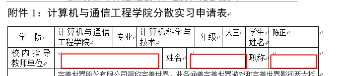

# 关于分散实习的一些问题
## 问题较多所以整理了一下，又给导员添麻烦了

***

## 导员您好

我今天终于收到了正式的完美世界录用通知，并决定就去完美世界了。现在我正在填写分散实习的申请表，但有一些问题不是很清楚，想要找您咨询：

***

### 1、关于`协作指导教师`

如图，用人单位就是实习公司，对于我来说就是完美世界吧。

那么就是说，我还要去找完美世界的某个前辈（上司？同事？hr？），请Ta帮忙做这个“协作指导教师”？

还要让Ta填这么一份我看了都觉得麻烦的登记表？

还是说，这已经是常年来默认的事情了，各学校学院都这样，各公司也都知道且基本早有安排，很容易就能搞定？原谅我我不是很清楚，希望导员解惑。

### 2、关于`校内指导教师`

如图，这里的校内指导教师指的是您？还是当初`认识实习`时的指导教师？又或者另有安排？

如果是您的话可能就要麻烦您了，如果是认识实习的话，记得给我安排的导师是刘宏兰老师，但我并没有参加学校统一的认识实习，当时是跟着教务处李大宽老师和创业公司的赖永刚学长，做新版教务系统来代替的。

当然如果是另有安排，无需我关心就好了。不过，申请表里的这几项（如下图）应该怎么填呢？

### 3、关于实习时间

面试时最后一轮hr面，初步沟通时我说的是今年6月到毕业这一段时间，也就是长期的实习。因为我已经从学长的创业公司退出，没经济来源了，所以也想有新的一份长期的兼职|实习。 ~~录用通知里的预计实习报到时间是6月1日，但还会再有人来与我沟通具体时间。~~ 刚刚接到hr的电话，希望我一周5天不间断的实习，允许在学校有事时临时请假，所以我已经初步把开始时间调整到了7月3日，还有待进一步确认。

问题是，分散实习的时间是小学期（校历是6月26日-7月16日）开始，还是暑期才开始？小学期暑期加起来也才两个月吧，那么申请表的实习时间我该怎么填？实习结束的具体时间、答辩的时间又是时候呢？

另外确认一下，我计划长期实习应该没问题吧？实习津贴是按出勤天数算的，我准备空闲没课没考试的时间拿来实习（其实在这之前我也一直是这么做的，在学长的创业公司）。前面说了还会有人与我沟通具体时间，所以如果学校有什么对实习时间特殊要求的话，我还能与他们商量修改。

### 4、关于申请分散实习的流程

根据我的理解，目前我需要填写`附件1：计算机与通信工程学院分散实习申请表`，然后还得请`协作指导教师`填写`附件2：计算机与通信工程学院聘请本科生分散实习协作指导教师登记表`对吧？然后表格应该提交给谁呢？电子版还是打印版呢？

***

## 最后，真的很感谢导员的帮助

最近因为实习的事情没少麻烦导员，我是下定决心不考研，直接工作的，所以很看重这次的机会，希望导员谅解，谢谢。