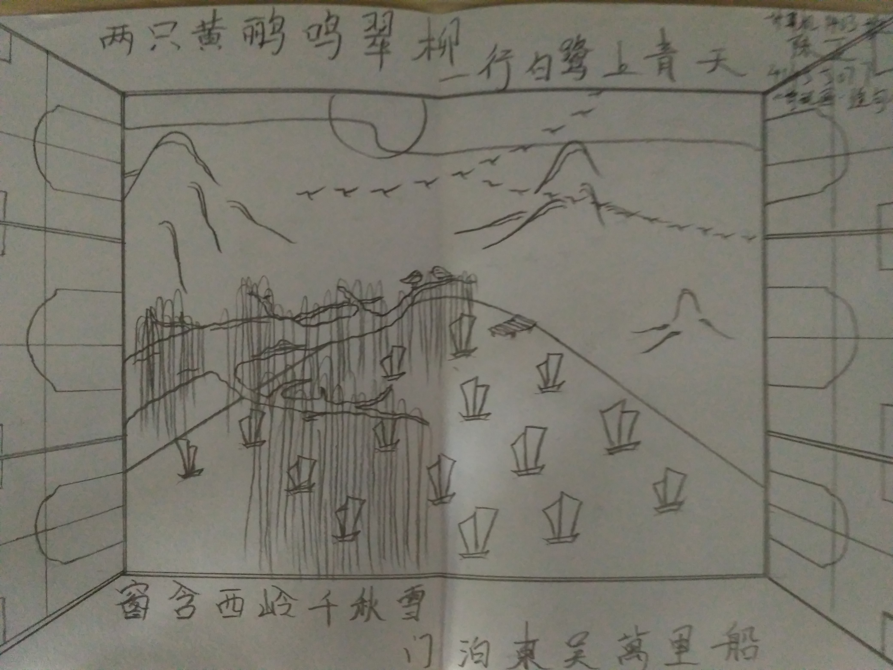

# 第三次作业
## 诗配画
***

    杜甫 - 绝句
    两个黄鹂鸣翠柳，一行白鹭上青天。
    窗含西岭千秋雪，门泊东吴万里船。

***
### 解说

杜甫的绝句确实是一首很精美的小诗，可以的话是不太想以它为题作画的，我这水平拙作配这诗太惭愧了。但既然题目要求了，硬着头皮也只能上了。

杜甫的这首绝句，作为大家耳熟能详的对偶的经典，在小学时我们就学过了。就意境来说的话，前两句里，`黄鹂`、`翠柳`、`白鹭`、`青天`，这简单的四个意象，非常准确的勾勒出了那初春时节、万物方苏、生机勃勃的气象，与作者当时所在的唐朝刚刚平定了安史之乱，迎来新的太平，百废待兴的局面相呼应，也与诗人度过灾乱流离，得以重返成都草堂时的欣悦心情相吻合。可以看到，在我的画里，也对这四个极具画面感的意象做了一一呈现，从前到后、由近及远依次排开。诗的后面两句，用词方面就大气多了，`西岭`、`东吴`、`千秋`、`万里`，时间空间都极为辽阔，进一步将画卷扩展，勾画出一个更为辽远壮大的场景，抒发了诗人此时展望未来，充满希望的胸怀，相比较大部分杜甫作品的沉闷压抑，可以说是难得的浪漫豪迈了。这里的意象更多的算是一种氛围和背景的烘托吧，所以我并没有再一一描绘，只是挑选了部分，将`窗`这个意象提到了画面最顶层，透过一个窗口来透视后面的景物，而`千秋雪`融入到了`西岭`里，`万里船`则布置在了画面下方的水中。

以上其实不是最关键的，如果只论意境的美，其实也可以有很多别的表述方式，比方说吧，“黄鹂两相依，轻停翠柳。白鹭结群，齐云上青天”，这样如何？当然这是我随便写的。总之，也有许多后人的词句，单论画面并不比这首诗差，那么之所以这首能经典，于我看来就在于“绝句”两字。所谓绝句者，五言七言一句，四句一首，讲究的是短小精炼，对仗工整。同样的，要为此诗配画，我觉得对称是很重要的，或者说，对称就是诗词创作里的对偶手法，在绘画方面的表现形式。所以可以看到，我的这幅画，并没有呈传统的三分之一黄金分割的布局，而是中规中矩地，从作为画布中心点的黄鹂开始，左下翠柳，右上白鹭，上青天，中西岭，下吴船的围绕中心对称而排；用一个同心的矩形，也就是窗，来框住景物；最外层则是轴对称的两扇窗页，缀以对称的纹理，一左一右，将画布限定。

最后要说的是，很久没有在纸上绘画了，毕竟计算机专业，还是摸着电脑才踏实，所以最近就算画画也是用板绘，纸上顶多打打草稿，找找布局和灵感，大部分工作已经习惯了依赖数位板和绘图软件来完成。加上手边也没有合适的笔绘工具，不允许交打印作品的话，只好随便抓了只2B铅笔画了，作品看起来确实比较简陋，还望老师见谅。
