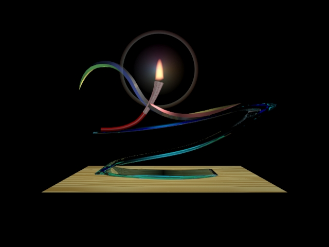

# 课程设计
## 自由泳

***
## 解说

> 自由泳（`freestyle`）是竞技游泳比赛项目之一，围绕着个主题，我从构图、形态、配色、材料、纹理及光影着手，设计了这一徽标。下面我将一一介绍：

### 1. 构图

> 徽标的主体构图由 '`f`' 与 '`s`' 两个英文字母组成，分别是 '`free`' 与 '`style`' 两个英文单词的首字母，而 '`freestyle`' 即是自由泳的英文拼法。字母 '`f`' 被抽象成了一个摆出`爬泳姿势`的人，而爬泳是自由泳比赛中最常见的泳姿。字母 '`s`' 则被设计成了`泳池的水浪`，作为整体徽标的底座。

### 2. 形态

> 徽标底座，即字母 's' `重心在前`，似一个正在抬升的浪头，而人体部分，即字母 'f' 则`重心偏后`。两者结合，即构成一种`平衡的美感`，又隐喻这自由泳运动员迎浪搏击，迎难竞技的`无畏身姿`。

### 3. 配色

> 构成人体手臂的元素为五棱边的条形体，五个棱面上分别采用`蓝`、`黑`、`红`、`黄`、`绿`的配色，与广为人知的奥运五环一一呼应，表现了自由泳是奥运竞技项目之一，受到五大洲全世界人们的共同的关注与认可。

### 4. 材料

> 徽标的底座，即字母 's' 选用透明且富有光泽的`水晶质感`，显得清澈而纯净，既与水的特点相符，又表达了竞技精神的纯粹与自然。而构成人体手臂的部分则选用带有柔和反光的`金属材质`，并带有平滑圆润的扭转，显得柔滑又不失刚硬，与兼具兼具力量感与优雅美的自由泳运动员体态相符。

### 5. 纹理

> 构成人体躯干的元素上边截饰以`祥云`图案的纹理，下半截喷涂成绛红色，与北京`奥运火炬`的设计一致，高雅华丽、内含厚重，表达这和谐竞赛、友谊竞争的主体。

### 6. 光影

> 在字母 'f' 的顶端，即构成人体造型的火炬上，有一团熊熊燃烧的火焰，象征着自由泳运动从第一届奥运至今仍广为人知、传承不息，以及自由泳运动员不断的挑战极限、超越自我，散发光和热的精神。

***
## 预览

